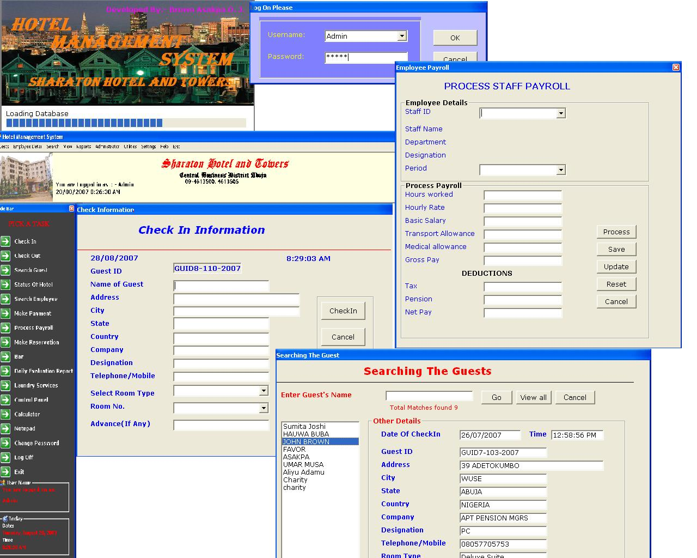



## Hotel Management System

### Description

This application handles the basic processes in running a hotel.checkin, checkout, employee record, search guest and employee, payroll, bar etc.
 
### More Info
 

             |
---                |---
**Submitted On**   |2007-09-07 12:55:46
**By**             |[John Brown Asakpa](https://github.com/Planet-Source-Code/PSCIndex/blob/master/ByAuthor/john-brown-asakpa.md)
**Level**          |Advanced
**User Rating**    |4.4 (44 globes from 10 users)
**Compatibility**  |VB 6\.0
**Category**       |[Databases/ Data Access/ DAO/ ADO](https://github.com/Planet-Source-Code/PSCIndex/blob/master/ByCategory/databases-data-access-dao-ado__1-6.md)
**World**          |[Visual Basic](https://github.com/Planet-Source-Code/PSCIndex/blob/master/ByWorld/visual-basic.md)
**Archive File**   |[Hotel\_Mana208243972007\.zip](https://github.com/Planet-Source-Code/john-brown-asakpa-hotel-management-system__1-69287/archive/master.zip)

